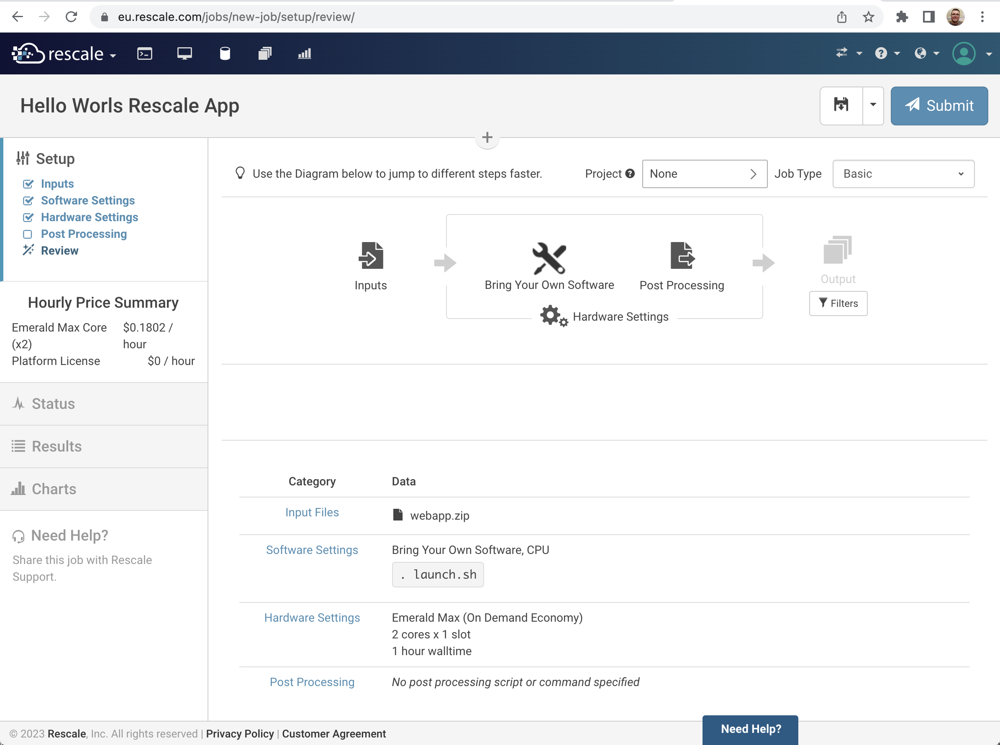

# Hello World Rescale App

The Hello World Rescale App is a basic web application that explains different aspects of web app development. It is used as an example to demonstrate the Rescale App deployment procedure. Rescale Web Apps are a unique method for packaging complex R&D applications for simple, on-demand browser-based access.

The goal of the Hello World App is to introduce engineers and researchers, that do not have extensive programming experience, to basic concepts used by high-level web applications frameworks. Frameworks like [Dash](https://dash.plotly.com/) or [Streamlit](https://streamlit.io/) hide many low-level details and allow focusing on the application features; however, it is always good to have some understanding of how such frameworks work.

## Quick start

Let's follow a usual sequence of developing an app locally and deploying it to a target hosting environment (a Rescale Job) when ready.

### Local development

The only prerequisite for local development is to have a Python 3.8+ interpreter installed on your machine. Follow these steps to check out the code and start a local web server.

```
# Clone repository
❯ git clone https://github.com/rescale-labs/App_HelloWorld_Flask
❯ cd App_HelloWorld_Flask

# Create and activate a virtual environment
❯ python -m venv .venv
❯ . .venv/bin/activate

# Install required libraries and start the server
❯ pip install -r requirements.txt
❯ python app.py
 * Serving Flask app 'app'
 * Debug mode: off
WARNING: This is a development server. Do not use it in a production deployment. Use a production WSGI server instead.
 * Running on http://127.0.0.1:5000
Press CTRL+C to quit
```

You can now point your server to `http://127.0.0.1:5000/hello` and you should see a hello world page.


Now you are ready to play around with the code and make changes, but first let's deploy our Rescale App.

### Deploying a Rescale App as Job inputs

Packaging our app for deployment is straightforward. While inside the root directory of the Hello World Rescale App code repository, issue a `zip` command to create a web app archive.

```
❯ pwd
/Workspace/App_HelloWorld_Flask
❯ zip -r webapp.zip *
```

On the Rescale Portal, create a new Job, upload the `webapp.zip` file as inputs, select `Bring Your Own Software` tile (CPU version), enter `. launch.sh` as the command, select a core type with 2 cores and hit Submit.

The review page of your Job should look like this.



Once started, look at the Job Logs section and search for the line mentioning the Notebook server. Highlight the link and open it in a new tab.


The page displayed in the browser should look like this.


https://eu.rescale.com/notebooks/bvxEMb

### Publishing a Rescale App using Rescale Software Publisher

> TODO: Stay tuned...

## How it works

The current integration of Rescale Apps with the platform relies on an existing feature that starts a Jupyter Notebook server on every cluster. This feature is not enabled by default. If you want to play with Rescale Apps, ask your Rescale contact to enable the `jupyter4all` flag for you, your workspace or the entire organization. 

The `jupyter4all` flag does two things that are leveraged by Rescale Apps. First, it injects a certificate and a key file that are used to establish a secure connection between the Rescale ScaleX platform and a web server running on a cluster. Second, it establishes a proxy that forwards HTTP requests issued to a public web address so these reach a cluster with a specific `cluster_id`.


The [launch.sh](launch.sh) script does all the magic. First, it kills the Jupyter Notebook server and then starts a web server which wraps our application and uses certificate and key to establish secure connections with the ScaleX Platform. The launch script also upgrades the Python installation.

The following command starts a WSGI-compliant web server that listens for secure connections on port `8888` and uses platform supplied certificate and key.

```
gunicorn -t 0 --certfile $HOME/.certs/nb.pem --keyfile $HOME/.certs/nb.key \
         -b 0.0.0.0:8888 wsgi:app
```

The port is fixed, as are the certificate and key files. The web application needs to be aware that all HTTP requests will be prefixed with `/notebooks/{cluster_id}` and need to be routed accordingly. See the last section to find out how requests are being routed within a web application.

### Proposed full integration

Rescale Apps are currently in a preview mode using the `jupyter4all` hack. We're trying to gather feedback on whether this method of extending the capabilities of HPC clusters is something desired by the community. We have ideas on how to integrate Rescale Apps with the Portal. Furthermore, we'd love to hear your ideas.

A possible integration with the Portal UI may look as follows. The Rescale App is detected by the frontend and uses a discovery endpoint to gather information that is displayed on the Job page. Instead of looking for the Jupyter Notebook link in the Logs section, users click on *Go To App* button.


## Web app development premier

How HTML, CSS and JavaScript are used to develop web applications.

> TODO: Stay tuned...