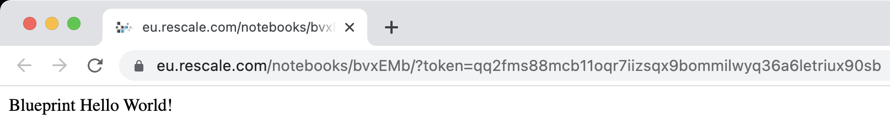
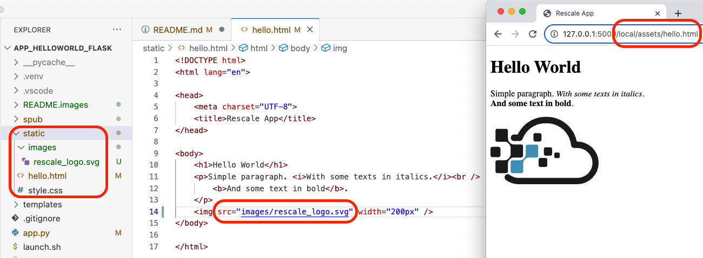

# Hello World Rescale App

The Hello World Rescale App is a basic web application that explains different aspects of web app development. It is used to demonstrate the Rescale App deployment procedure. Rescale Web Apps are a unique method for packaging complex R&D applications for simple, on-demand browser-based access.

The goal of the Hello World App is to introduce engineers and researchers, that do not have extensive programming experience, to basic concepts used by high-level web applications frameworks. Frameworks like [Dash](https://dash.plotly.com/) or [Streamlit](https://streamlit.io/) hide many low-level details and allow focusing on the application features; however, it is always good to have some understanding of foundational technologies such frameworks are built upon.

## Quick start

Let's follow a usual sequence where we develop a web app locally and deploy it to its target hosting environment (here, a Rescale Cluster).

### Local development

The only prerequisite for local development is to have a Python 3.8+ interpreter installed on your machine. Follow these steps to check out the code and start a local web server.

```
# Clone repository
❯ git clone https://github.com/rescale-labs/App_HelloWorld_Flask
❯ cd App_HelloWorld_Flask

# Create and activate a virtual environment
❯ python -m venv .venv
❯ . .venv/bin/activate

# Install required libraries and start the server
❯ pip install -r requirements.txt
❯ python app.py
 * Serving Flask app 'app'
 * Debug mode: off
WARNING: This is a development server. Do not use it in a production deployment. Use a production WSGI server instead.
 * Running on http://127.0.0.1:5000
Press CTRL+C to quit
```

We can now point our browser to http://127.0.0.1:5000/hello, and we should see the hello world page.


We are ready to play around with the code and make changes, but first let's deploy our Rescale App to the Rescale Platform.

### Deploying a Rescale App as Job input

Packaging our app for deployment on Rescale is straightforward. While inside the root directory of the Hello World Rescale App code repository, issue a `zip` command to create a web app archive.

```
❯ pwd
/Workspace/App_HelloWorld_Flask
❯ zip -r webapp.zip *
```

On the Rescale Portal, create a new Job, upload the `webapp.zip` file as inputs, select `Bring Your Own Software` tile (CPU version), enter (. launch.sh`) as the command, select a core type with 2 cores and hit Submit.

The review page of your Job should look like this.


Once started, look at the Job Logs section and search for the line mentioning the Notebook server. Highlight the link and open it in a new tab.


The page displayed in the browser should look like this.



### Publishing a Rescale App using the Rescale Software Publisher

Deploying a Rescale App as Job input is good for testing during development. For production, deploying a Rescale App, so it is accessible from the Rescale Software Catalog, provides a much better user experience. This can be achieved using the [Rescale Software Publisher (SPub)](https://rescale.com/documentation/main/platform-guides/bring-your-own-software-with-rescale-software-publisher/).

Here, we will use SPub integration with the Rescale CLI, and perform a fully automated (scripted) deployment.

Prerequisites:

* Software Publisher is enabled for your Company and you have an admin role on a Workspace or Company level. Get in touch with your Rescale representative to get this feature enabled.
* The [Rescale CLI](https://rescale.com/documentation/main/rescale-advanced-features/rescale-cli-1-1-x/setting-up-rescale-cli-110/) installed and configured.

The [spub/](spub/) directory contains publication related scripts and files. Let's start from the [build.sh](spub/build.sh) script, which drives the publication process. It executes the following operations:

* Template files are instantiated—this allows us to define the mount point, analysis code and analysis version in one place.
* An archive containing all web app files is created.
* Rescale CLI (`spub tile create`) operation is invoked with `settings.json` as input. A Sandbox with the build environment is created, and input files are uploaded. The Sandbox ID is captured.
* Rescale CLI (`spub sandbox connect`) operation is invoked to get the `SSH` command that allows us to execute the build script on the Sandbox (this is a workaround).
* Finally, after a successful build, the Rescale CLI (`spub tile publish`) command is invoked and temporary files are deleted.

> NOTE: Due to current limitations of the SPub-RescaleCLI integration, the script uses workarounds to execute the build command within the Sandbox. In the future `install.command` defined in `settings.json` will suffice and the publication script will be simplified.

Sample output from the `build.sh` script invocation is in [`spub_sample_output.out`](spub/spub_sample_output.out).


Let's dive into supporting files and scripts.

The [`settings.json`](spub/settings.json-templ) defines the analysis metadata. The `sandbox` section specifies the Sandbox cluster (required number of cores, operating system, MPI version, …). Files to be transferred to the Sandbox are specified as `inputFiles`. In case we want to use files previously uploaded to cloud storage, we can list their IDs in `inputFileIds`.

The `install` section defines `mountPoint` for our installation. This will be a subdirectory of the `/program` folder. Files copied to the mount point will be included in the package snapshot. The `volumeSize` parameter is the disk size in GB—this should be big enough to fit the installation files.

The `software` section includes analysis metadata. Mount points and analysis codes need to be globally unique within the Rescale Software Catalog. A common way to achieve this is to use your company domain as a prefix to your analysis code. Use alphanumeric characters and underscores only (names need to be filesystem-friendly). Append analysis code to the prefix to define mount point. For example,

```
analysis_code=com_rescale_my_analysis
mount_point=/program/$(analysis_code)       -> /program/com_rescale_my_analysis
```

Build process is captured in [`spub_build.sh`](spub/spub_build.sh-templ). First, we install Miniconda inside the mount point. Then we copy the web app source code. After creating the Python virtual environment, we install all dependent modules.

The [`spub_launch.sh`](spub/spub_launch.sh-templ) file, also copied to mount point, launches the App. It is similar to [the `launch.sh`](launch.sh) script, but includes only the web server startup, since all required software and dependencies were installed as part of the software publication.

Once published, the Hello World Rescale App is visible in the Software Catalog. Users can launch a Job using a familiar flow without worrying about the low-level details.


## How it works

The current integration of Rescale Apps with the platform relies on an existing feature that starts a Jupyter Notebook server on every cluster. This feature is not enabled by default. If you want to play with Rescale Apps, ask your Rescale contact to enable the `jupyter4all` flag for you, your workspace or the entire organization. 

The `jupyter4all` flag does two things that are leveraged by Rescale Apps. First, it injects a certificate and a key file that are used to establish a secure connection between the Rescale ScaleX platform and a web server running on a cluster. Second, it establishes a proxy that forwards HTTP requests issued to a public web address so these reach a cluster with a specific `cluster_id`.


The [`launch.sh`](launch.sh) script does all the magic. First, it kills the Jupyter Notebook server and then starts a web server which wraps our application and uses certificate and key to establish secure connections with the ScaleX Platform. The launch script also upgrades the Python installation and installs all required dependencies (this is skipped for Rescale Apps published with SPub).

The following command starts a [WSGI-compliant](https://peps.python.org/pep-3333/) web server that listens for secure connections on port `8888` and uses a platform supplied certificate and key to encrypt data sent over the internet with [TLS](https://developer.mozilla.org/en-US/docs/Web/Security/Transport_Layer_Security).

```
gunicorn -t 0 --certfile $HOME/.certs/nb.pem --keyfile $HOME/.certs/nb.key \
         -b 0.0.0.0:8888 wsgi:app
```

The port is fixed, as are the certificate and key files. The web application needs to be aware that all HTTP requests will be prefixed with `/notebooks/{cluster_id}` and need to be routed accordingly. See the following sections to find out how requests are being routed within a web application.

### Proposed integration with the Rescale Portal

Rescale Apps are currently in a preview mode using the `jupyter4all` hack. We're trying to gather feedback on whether this method of extending the capabilities of HPC clusters is something desired by the community. We have ideas on how to integrate Rescale Apps with the Portal. We'd love to hear your ideas.

A possible integration with the Portal UI may look as follows. The Rescale App is detected by the frontend and uses a discovery endpoint to gather information that is displayed on the Job page. Instead of looking for the Jupyter Notebook link in the Logs section, users click on the *Go To App* button.


## Web app development premier

Web applications leverage three main technologies. A markup language ([HTML](https://developer.mozilla.org/en-US/docs/Glossary/HTTP)) that defines the structure of a document. Styling language ([CSS](https://developer.mozilla.org/en-US/docs/Glossary/CSS)) which defines how an HTML document is rendered (layout, fonts, colors, …). A scripting language ([JavaScript](https://developer.mozilla.org/en-US/docs/Glossary/JavaScript)) that can dynamically modify an HTML document and its styling, often in response to queries made against external web services (APIs).

The purpose of this section is to give an overview of these technologies, so when we move to using high-level web app development frameworks, we will have an understanding of the foundational technologies they refer to.

The Hello World Rescale App demonstrates simple application of HTML, CSS, and JavaScript. In practice, these technologies are not often used in the same, low level, manner. Applications are split into backend code (server-side APIs) and frontend code (code running in a browser). High-level frameworks exist for both backend and frontend programming.

Some web app development frameworks generate backend and frontend code from a single codebase. These are preferable for rapid development and provide simplified interfaces that can be quickly learned by non-programmers. Frameworks like [Dash](https://dash.plotly.com/) or [Streamlit](https://streamlit.io/) are ideal for developing simulation and data-driven apps.

The Hello World Rescale App showcases basic web technologies discussed in this section. Readers are advised to start the app locally and play around (see [Local development](#local-development)).

### Servers and Browsers

Web servers respond to client requests using the [HTTP protocol](https://developer.mozilla.org/en-US/docs/Web/HTTP). Requests are made against unique addresses. These addresses, have a form of a [URL](https://developer.mozilla.org/en-US/docs/Web/HTTP/Basics_of_HTTP/Identifying_resources_on_the_Web), for example https://random.org/passwords/?num=5&len=12&format=plain&rnd=new. URLs start with the protocol (`http|https`), followed by the domain name (`random.org`), followed by a path (`/passwords/`) and optional query (`?num=5&len=12&format=plain&rnd=new`).

HTTP requests use different [HTTP methods](https://developer.mozilla.org/en-US/docs/Web/HTTP/Methods). The most frequently used are the [`GET`](https://developer.mozilla.org/en-US/docs/Web/HTTP/Methods/GET) method and the [`POST`](https://developer.mozilla.org/en-US/docs/Web/HTTP/Methods/POST) method.

The `GET` method requests a resource at a specific path. Resource contents may be fine-tuned by query parameter. The server responds with a document, which may be static or dynamically generated (for example, in response to a parameterized query).

The `POST` method includes a payload as part of the request. It can be the contents of an HTML form, a JSON document, or a binary file. As for the `GET` method, a server will respond with a document or with no content.

All responses include a specific [HTTP response status code](https://developer.mozilla.org/en-US/docs/Web/HTTP/Status). Status codes in the `200-299` range signify success. Status codes above `400` signal some kind of error.

A web browser will issue HTTP requests and try to present the result depending on its [MIME type](https://developer.mozilla.org/en-US/docs/Glossary/MIME_type). A web browser may do the following depending on the MIME type:

* `text/html` – render a web page
* `image/png` – display image
* `application/json` – display JSON document

It is important to note that a web browser is just one of many clients that can communicate with web servers. HTTP requests can be issued by command line clients (like [`curl`](https://curl.se/)) or programmatically, from application code (for example, using the [`requests`](https://pypi.org/project/requests/) Python module).

Web browsers can execute code on the client side (on a machine running the web browser program). Such code can dynamically rewrite the HTML document, rendered in a browser, in response to user actions or other events. All modern browsers include a high-performance JavaScript interpreter.

When content displayed in a browser is controlled solely by JavaScript, we no longer navigate through the Web of hyperlinked documents, we interact with a web application (web app). These applications are often referred to as Single Page Applications (SPAs).

The following diagram presents example `[req]`uest-`[res]`ponse interactions between a browser (client) and a web server.


To see how communication between a client and a web server looks like, try to execute the following `curl` command and inspect the output.

```
$ curl -v "https://www.random.org/passwords/?num=5&len=12&format=plain&rnd=new"

### IP address is resolved, SSL negotiation begins, secure socket connection is established

*   Trying 172.66.43.252:443...
* Connected to www.random.org (172.66.43.252) port 443 (#0)
* ALPN: offers h2,http/1.1
* (304) (OUT), TLS handshake, Client hello (1):
*  CAfile: /etc/ssl/cert.pem
*  CApath: none
* (304) (IN), TLS handshake, Server hello (2):
...
*  SSL certificate verify ok.
...

### Request using the HTTP protocol

> GET /passwords/?num=5&len=12&format=plain&rnd=new HTTP/2
> Host: www.random.org
> user-agent: curl/7.88.1
> accept: */*

### Response adhering to the HTTP protocol

< HTTP/2 200                                # status code 
< date: Tue, 04 Jul 2023 12:03:28 GMT
< content-type: text/plain;charset=UTF-8    # response MIME type
< content-length: 65
...
< 
deMsPddMfnj8                                # response content
Bby5A886HUuj
RCdDXPwhf9CJ
XSQ5yYnGym7D
Lh5VRCVA7NMR
* Connection #0 to host www.random.org left intact
```

Let's retrace the above sequence of events. First, a Domain Name System ([DNS](https://en.wikipedia.org/wiki/Domain_Name_System)) server is contacted to resolve the domain name (`random.org`) to an IP address (`172.66.43.252`)—this lookup is performed using operating system-level calls and is usually transparent to a client. Once the IP address is known, the HTTP client tries to establish a TCP/IP connection. This needs to use a specific port number. The default port for `https` is `443` – that why we see `Trying 172.66.43.252:443...`.

Note that an HTTP server can listen for connections on an arbitrary port number, we have noticed that our local development server's URL was `http://127.0.0.1:5000` – a port number (`5000`) is specified as part of the URL (`127.0.0.1` address is a reserved address that always points to `localhost`). Our local server uses unencrypted `http` protocol. This is useful for development (if needed, we could observe the actual packets), but should never be used in production. A server can be configured to expect TLS negotiation on any port.

Once a TCP/IP level socket connection is established, a secure Transport Layer Security ([TLS](https://developer.mozilla.org/en-US/docs/Web/Security/Transport_Layer_Security)) context is negotiated (TLS is often user interchangeably with the old term [SSL](https://developer.mozilla.org/en-US/docs/Glossary/SSL)). Once established, all traffic is encrypted.

During the TLS negotiation, the server's certificate is being validated. Often, development servers or internal servers will have self-signed certificates that cannot be validated by tracing the validation chain up to a trusted Certificate Authority ([CA](https://developer.mozilla.org/en-US/docs/Glossary/Certificate_authority)).

Certificate validation errors do not necessarily mean that a connection is untrusted. Organizations may have internal, trusted CAs established. In such cases, the organization's root certificate is added to the list of trusted CAs. Most tools/libraries will also add an option to ignore certificate validation errors. This may be handy in development environments, but should be used with caution in production. An example of a failed validation attempt and a validation override is presented below,

```
$ curl https://self-signed.badssl.com/
curl: (60) SSL certificate problem: self signed certificate
More details here: https://curl.se/docs/sslcerts.html

curl failed to verify the legitimacy of the server and therefore could not
establish a secure connection to it. To learn more about this situation and
how to fix it, please visit the web page mentioned above.

$ curl --insecure https://self-signed.badssl.com/
<!DOCTYPE html>
<html>
<head>
...
```

When our client expects to be able to connect using TLS and the target web server is not configured to accept TLS secured client connections, we will get errors. For example, development servers often do not have TLS configured,

```
$ curl -v https://127.0.0.1:5000
*   Trying 127.0.0.1:5000...
* Connected to 127.0.0.1 (127.0.0.1) port 5000 (#0)
* ALPN: offers h2,http/1.1
* (304) (OUT), TLS handshake, Client hello (1):
*  CAfile: /etc/ssl/cert.pem
*  CApath: none
* LibreSSL/3.3.6: error:1404B42E:SSL routines:ST_CONNECT:tlsv1 alert protocol version
* Closing connection 0
```

Conceptually, TLS encrypted HTTP protocol requests can be visualized as follows,


A server, hosting a Rescale App, needs to have TLS enabled. The Rescale control plane provides the server certificate and a corresponding private key. These are generated dynamically for each cluster. The certificate is self-signed and trusted by the reverse proxy that is responsible for forwarding HTTPS requests issued against a URL in the `rescale.com` domain. Continue to the next section to find out more about request forwarding, routing, and proxies.

### Paths, routing, static files and reverse proxies

Most modern web app frameworks use the concept of routing. Basically, application routes define what code is executed in response to requests matching different URL paths.

Let's take a look at the following routes defined in our [Hello World App](app.py) implemented with the [Flask framework](https://flask.palletsprojects.com/en/2.3.x/).

```
@app.route("/hello")
def hello():
    return "Hello World!"

@app.route("/hello/<name>")
def hello_name(name):
    return f"Hello {name}!"
```

The `@app.route` annotations are used to mark functions to be executed in response to requests that have matching paths. Looking at responses will clarify it.

```
1❯ curl http://127.0.0.1:5000/hello
Hello World!

2❯ curl http://127.0.0.1:5000/hello/Adam
Hello Adam!

3❯ curl http://127.0.0.1:5000/hello/Adam/Smith
404 Not Found

# No route defined to match /hello/<x>/<y> - requested resource is NOT FOUND

4❯ curl http://127.0.0.1:5000/hello/Adam Smith
Hello Adam!curl: (6) Could not resolve host: Smith

5❯ curl http://127.0.0.1:5000/hello/Adam%20Smith
Hello Adam Smith!

# Special characters need to be URL encoded to work as expected
```

In the case of Rescale Apps, the Rescale platform acts as a [reverse proxy—all requests made against a public web address are passed though to the cluster serving the web app (hiding the web server identity). The request path needs to include a unique identifier that allows the proxy to decide which Rescale cluster should receive the request.

Currently, the path has a form of `/notebooks/{cluster_id}/`. This means that all request paths reaching the web server running on a cluster will have a static prefix with `cluster_id`. The platform assumes that the web server will accept TLS encrypted connections on a static port `8888`.

```
https://platform.rescale.com/notebooks/{cluster_id}/
->
https://{cluster_ip}:8888/notebooks/{cluster_id}/
```

Most web frameworks provide facilities to globally define such a prefix. Flask has a concept of a [Blueprint](https://flask.palletsprojects.com/en/2.3.x/blueprints/). This is how we used it in [app.py](app.py).

```
RESCALE_CLUSTER_ID = os.getenv("RESCALE_CLUSTER_ID")
PREFIX = (
    "/local/"
    if RESCALE_CLUSTER_ID == None
    else f"/notebooks/{RESCALE_CLUSTER_ID}/"
)

rescale_bp = Blueprint(
    "rescale_app",
    __name__,
    template_folder="templates",
    static_folder="static",
    static_url_path=f"assets",
    url_prefix=,
)

@rescale_bp.route("/")
def hello():
    return "Blueprint Hello World!"
```

When deployed on Rescale, a web app expects requests prefixed with `/notebooks/{cluster_id}`. Each Rescale cluster has access to the `RESCALE_CLUSTER_ID` environmental variable, the value of which is used to build the prefix. If this variable is not set (we have a local development server) – the prefix is set to `/local/`.

Now, the root `/` route for `rescale_bp` blueprint will match `/notebooks/{RESCALE_CLUSTER_ID}` or `/local/` as the examples below demonstrate. Both requests execute the same function.

```
❯ curl https://platform.rescale.com/notebooks/hYqUHc/
Blueprint Hello World!

❯ curl http://127.0.0.1:5000/local/
Blueprint Hello World!
```

One last thing that needs to be discusses is handling static content. Not all request path will require execution of dynamic code to formulate a response. Often, a given path will point to a static file, such as an image. Static content rarely changes and can be efficiently cached. We have configured our Flask Blueprint to serve files from the `static` folder under `assets` path. The image below demonstrates the situation.



The `/local/assets/hello.html` path will serve an HTML document stored in `./static/hello.html` file. The HTML page references `images/rescale_logo.svg` file. This is a relative path that resolves to `/local/assets/images/rescale_logo.svg` and serves a file stored in `./static/images/rescale_logo.svg`.

In this section, we discussed the server side of our web app. Now let's move to the browser side and discuss how web browsers interpret resources returned from HTTP requests and how they can interact with web servers.

### HTML: HyperText Markup Language

[HTML](https://developer.mozilla.org/en-US/docs/Web/HTML) is the basic building block of the web. It describes the structure of a web document and allows for hyperlinking web pages. It has been around since the dawn of the [World Wide Web](https://developer.mozilla.org/en-US/docs/Glossary/World_Wide_Web).

The [hello.html](static/hello.html) file is an example of a static HTML page.

```
<!DOCTYPE html>
<html lang="en">

<head>
    <meta charset="UTF-8">
    <title>Rescale App</title>
</head>

<body>
    <h1>Hello World</h1>
    <p>Simple paragraph. <i>With some texts in italics.</i>
    </p>
    <b>And some text in bold</b>.
    
    <br />
    Copyright &copy; <a href="https://rescale.com">Rescale</a>
    <br />
    Copyright © <a href="https://rescale.com">Rescale</a>
</body>

</html>
```

An HTML document is built from a set of markup elements that annotate text, links, images and other elements. The document is split into `<head>` section, which includes document metadata and the `<body>` section, which includes content to be displayed. Within the body, we see elements such as heading `<h1>`, paragraph `<p>`, line break `<br>`, image ``, hyperlink `<a>` and some text styling: italics `<i>` and bold `<b>`.

It is not necessary to know all HTML elements to use high-level web application frameworks. However, it is good to be aware of the most frequently used markup.

Note that using HTML elements is essential from the usability perspective. HTML markup provides semantic information about the document structure. This helps enormously when a web page is accessed by visually impaired users, who often use screen readers. Using headings, paragraphs, emphasis while sticking to their semantics makes our pages more inclusive.

There is one HTML element that will pop up quite frequently in the context of single page web applications, especially when it comes to laying out components and applying style. It is the content division element or the [`<div>` element](https://developer.mozilla.org/en-US/docs/Web/HTML/Element/div). The section on style sheets explains its application.

#### HTML Templates

Instead of serving static HTML documents, web servers can generate them dynamically. One of the approaches is to use template engines. Our Hello World Flask application uses a template, for example, to dynamically render documents matching the following path

```
@rescale_bp.route("/echo/<path:path>")
def catch_all(path):
    return render_template(
        "index.html", headers=get_headers(request), top_20=get_top(20)
    )
```

The `render_template` function takes the [index.html](templates/index.html) template as input and provides two parameters, `headers` which is a dictionary of key-value pairs extracted from request headers, and `top_20` which is a string generated by a `ps` command listing the top 20 processes that utilize most memory.

Flask employs the [Jinja2](https://jinja.palletsprojects.com/en/3.1.x/templates/) template engine. In our template, we make use of the loop construct to add rows to an HTML table and a simple value replacement for the top 20 processes.

```
    <tbody>
        
        <tr>
            <td> {{ key }} </td>
            <td> {{ value }} </td>
        </tr>
        
    </tbody>
</table>
<h1>top_20</h1>
<pre>{{ top_20 }}</pre>
```

Pointing a browser to http://127.0.0.1:5000/local/echo/test will result is a page similar to the following


Now, the browser uses a default style to render HTML content. The rendering contains all the information, but is not visually pleasing. Let's try to give our webpage some style.

To find out more about HTML, see [HTML basics](https://developer.mozilla.org/en-US/docs/Learn/Getting_started_with_the_web/HTML_basics).

### CSS: Cascading Style Sheets

[Cascading Style Sheets](https://developer.mozilla.org/en-US/docs/Web/CSS) is a stylesheet language used to describe how an HTML document is rendered, on screen, by a web browser (and potentially on alternative mediums, like printers).

Mastering CSS is one of the most difficult aspects of front-end development. Fortunately, multiple frameworks and component libraries exist, that abstract away many low-level details (including cross-browser incompatibilities) and allow developers to focus on functionality and user experience. As with HTML, it is worthwhile to know basic concepts, for there will be times when we want to fine-tune how our web app looks.

Directing a browser to http://127.0.0.1:5000/local/style shows our test page with styling applied. It looks much better, right?


Stylesheet can be defined within an HTML document's [`<style>` element](https://developer.mozilla.org/en-US/docs/Web/HTML/Element/style), it can also be defined as an element's [`style` attribute](https://developer.mozilla.org/en-US/docs/Web/HTML/Global_attributes/style). However, usually, a stylesheet is decoupled from the HTML document and stored in a separate `.css` file (in our case [`static/style.css`](static/style.css)). This file is then referenced from the HTML document using the [`<link>` element](https://developer.mozilla.org/en-US/docs/Web/HTML/Element/link). See [`templates/style.html`](templates/style.html) for an example of an HTML file referencing an external stylesheet.

```
<link rel="stylesheet" href="{{ static_path }}/style.css">
```

A CSS stylesheet contains a collection of style rules. Each rule starts from an [attribute selector](https://developer.mozilla.org/en-US/docs/Web/CSS/Attribute_selectors) defining which elements it applies to, and a set of declarations, which take the form of property-value pairs. For example, the following rules define font family and size for all children of the `<body>` element. The `<pre>` element is a child of the `<body>` element and by default inherits the style of `<body>` (this one of the results of [CSS Cascading](https://developer.mozilla.org/en-US/docs/Web/CSS/Cascade)). Our style for `<pre>` overrides the value of the `font-size` property. This rule has higher specificity and will take precedence.

```
body {
    font-family: 'Roboto Mono', monospace;
    font-size: 10pt;
}

pre {
    font-size: 12pt;
}
```

Other selectors include `classes`,

```
.row {
    display: flex;
}

# HTML
<div class="row">
```

and IDs.

```
# CSS
#headers {
    border-collapse: collapse;
}

# HTML
<table id="headers">
```

It is possible to apply multiple `classes` to an element and extend its style definition by specifying the `style` attribute of an HTML element. In our example:

```
<div class="column rescalebg" 
        style="background-image: url('{{ static_path }}/images/rescale_logo.svg');">
```

The `<div>` elements are often used to define content containers that are then laid out using CSS. In our example, the following rules utilize the [CSS flexible box layout](https://developer.mozilla.org/en-US/docs/Web/CSS/CSS_flexible_box_layout) module to define a 2 column layout.

```
# HTML
<div class="row">
    <div class="column">

# CSS
.row {
    display: flex;
}

.column {
    flex: 50%;
    margin: 10px;
}
```

So far, the HTML content has been generated server side in response to `GET` requests. Let's try to make things more dynamic by generating content based on user input (forms) and by dynamically rewriting the HTML document based on responses from 

To find out more about CSS, see [CSS basics](https://developer.mozilla.org/en-US/docs/Learn/Getting_started_with_the_web/CSS_basics).

### Forms and JavaScript

[Web forms](https://developer.mozilla.org/en-US/docs/Learn/Forms) are a subset of HTML elements that allow for interaction with users. 

The [`templates/form.html`](templates/form.html) file, includes a basic form that queries a user to provide the number of processes with the highest memory utilization that should be displayed. The [form element](https://developer.mozilla.org/en-US/docs/Web/HTML/Element/form) embeds text input and a submit button. The `method="POST"` attribute specifies the HTTP method to use when submitting data to a server. The `action` attribute points to the URL that will handle the request, if left empty (or omitted) it will default to the current URL.

```
<form method="POST" action="">
    <label>Number of processes with highest memory usage</label>
    <input type="text" name="count">
    <input type="submit" value="Show">
</form>
```

Server-side code needs to be prepared to handle both `GET` and `POST` requests. In our example, we define the following route where we check the request method type and if it is `POST`, we extract the value of an input with name `count`.

```
@rescale_bp.route("/form", methods=["GET", "POST"])
def formed():
    count = 20
    if request.method == "POST":
        count = request.form.get("count", default=20)

    return render_template("form.html", top=get_top(count), count=count)
```

Open http://127.0.0.1:5000/local/form to see the form in action.


In response to the form submission, the server responds with a new HTML document that had to be rendered from scratch. The entire page was reloaded. Since the page is basic, we did not notice the reload time.

What if we had a more complex page, and we wanted to update only a section of it based on some new data. This is where we need to employ JavaScript.

JavaScript is a scripting language that can be interpreted by most modern web browsers. It's a general purpose, dynamic language that, in-principle, could be used to develop simulation code to run in your browser. In the context of web applications, it is used for 2 major purposes:

* to modify the HTML page elements, in-place, using the [Document Object Model](https://developer.mozilla.org/en-US/docs/Glossary/DOM),
* to send API requests in response to user actions and other triggers.

Let's take a look at our example script in [`templates/script.html`](templates/script.html). Here, JavaScript code is embedded in the HTML document. Usually, similar to CSS stylesheets, scripts are stored in separate `.js` files and loaded via links.

Let's open http://127.0.0.1:5000/local/script to see our script in action.


Our script invokes the built-in [`setInterval`](https://developer.mozilla.org/en-US/docs/Web/API/setInterval) function to trigger our function every 2 seconds. The function, first, gets a random integer from 1-10 range and then uses the built-in [`fetch`](https://developer.mozilla.org/en-US/docs/Web/API/fetch) function to get a JSON document from a web [API](https://developer.mozilla.org/en-US/docs/Glossary/API). Our server code, exposes a route that returns, a [JSON](https://developer.mozilla.org/en-US/docs/Learn/JavaScript/Objects/JSON) formatted document, that is easy to parse by JavaScript.

Try http://127.0.0.1:5000/local/api/top?count=2 to call the API endpoint from a browser address bar. The result is as follows.

```
{
  "top": [
    {
      "mem": 2.3,
      "proc": "Slack"
    },
    {
      "mem": 2.1,
      "proc": "plugin-container"
    }
  ]
}
```

Our script, captures the response and updates elements within the DOM model of our HTML page. In the following excerpt, we have a header element with specific `id`. First, the script extracts the element by its `id` and then populates its content based on values from the JSON array received from the API.

```
<h2 id="top_proc"></h2>
...
<script>
    const topProcElement = document.getElementById('top_proc');
    topProcElement.innerText =
        "Process: " + data.top[0].proc + "; Memory %: " + data.top[0].mem;
...
</script>
```

Now, that we have covered the basic technologies behind web applications, let's shortly discuss a practical aspect of debugging web apps.

To find out more about JavaScript, see [JavaScript basics](https://developer.mozilla.org/en-US/docs/Learn/Getting_started_with_the_web/JavaScript_basics).

### Debugging web applications

Web applications are trickier to debug than “normal applications” as they are distributed and execute in distinct environments: the server and the browser. Server-side code is relatively easy to debug, as the same techniques developed for non-distributed applications can be used.

Debugging code running in a browser used to be much harder. However, nowadays, developer tools embedded in all modern browsers give programmers powerful utilities to probe not only execution paths but also network communication and performance. See below for an example developer tools session analyzing our JavaScript example. 


## What next?

To build your simulation or machine learning app rapidly, consider using one of the high-level web application frameworks. Since Python is used to script many simulation engines and is used extensively by the machine learning community, Python-based frameworks have a shallow learning curve.

Frameworks to consider include:

* https://dash.plotly.com/
* https://www.gradio.app/
* https://streamlit.io/

Stay tuned. Examples are coming…

## About the author and Rescale

[Rescale™](https://rescale.com) is a technology company that builds cloud software and services that enable organizations of every size to deliver engineering and scientific breakthroughs that enrich humanity.

[Bartek Dobrzelecki](linkedin.com/in/bardobrze) is a Customer Success Engineer at Rescale with a background in High Performance Computing and Software Engineering. He is always keen to share his knowledge, demystify technology and democratize computational thinking. He strongly believes that no technology should be indistinguishable from magic.